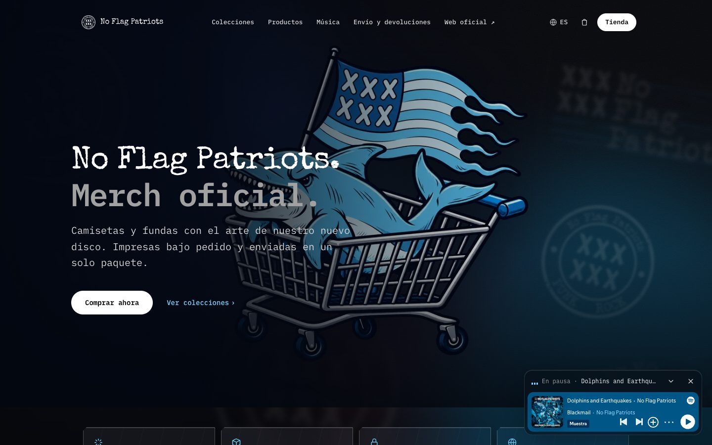

# NFP Clothing

**Tienda online de merchandising del grupo No Flag Patriots, con impresión bajo pedido y sin stock propio.**

[nfpclothing.com](https://www.nfpclothing.com)



## Cómo funciona

1. El cliente elige diseño, prenda y talla, y lo añade al carrito.
2. Paga sin salir de la tienda con **Stripe Embedded Checkout**.
3. Stripe avisa a la tienda con un **webhook firmado** (`/api/webhooks/stripe`, se verifica la firma antes de hacer nada).
4. La tienda crea el pedido en **Gelato** por API: ellos imprimen la prenda y la envían al cliente.

Así no hace falta stock ni gestionar envíos: cada venta se imprime cuando ya está pagada.

## Qué incluye

- Catálogo de 14 productos con variantes (prenda, color y talla) y maquetas de cada diseño.
- Carrito persistente, página de producto y página de pedido completado.
- Portada con colecciones, lookbook y reproductor con la música del grupo.
- Tres idiomas: español, catalán e inglés.
- Imagen para compartir en redes (Open Graph) e iconos propios.

## Stack

Next.js 16 (App Router, Server Actions) · React 19 · TypeScript · Tailwind CSS · Stripe · Gelato API · Vercel

## Desarrollo

```bash
npm install
npm run dev
```

Variables necesarias en `.env.local`: `STRIPE_SECRET_KEY`, `NEXT_PUBLIC_STRIPE_PUBLISHABLE_KEY`, `STRIPE_WEBHOOK_SECRET`,
`GELATO_API_KEY` y `NEXT_PUBLIC_SITE_URL`.

Para explorar el catálogo de Gelato desde la terminal: `node scripts/gelato-search.mjs catalogs` (más opciones dentro del
script).

---

Hecho por [Miguel Liébana](https://miguelliebana.com), también compositor y cantante del grupo.
